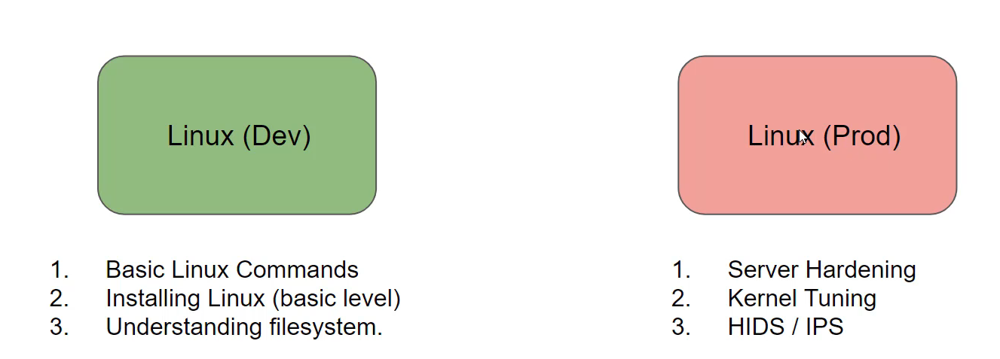
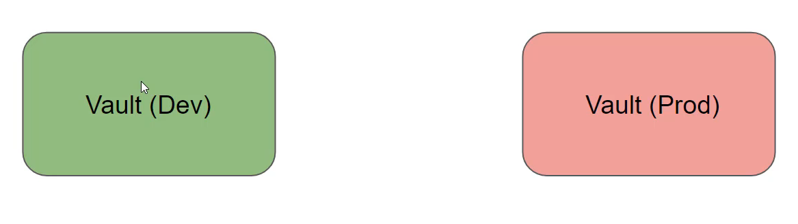

## Leraning Approch

Whenever you learn any technology, you start from very basics and keep it simple initially.
Once you are comfortable with the basics, you go more in-depth about aspects like security, high-availability and others.

<div align="center">

</div>

## Overview of vault Dev mode
The Dev server mode in Vault is useful for local development, testing and exploration.
Not very secure.
Everything is stored in memory (will lose data on every restart).


<div align="center">

</div>

## Satrting Vault Dev Mode

you can start Vault server in "dev" mode like so;

```
vault server -dev

```

<div align="center">

</div>

## Enviroment Variables

There is one primary enviroment varibales that we need to set 

```
VAULT_ADDR=http://127.0.0.1:8200 #for windows

export VAULT_ADDR

valut status

```