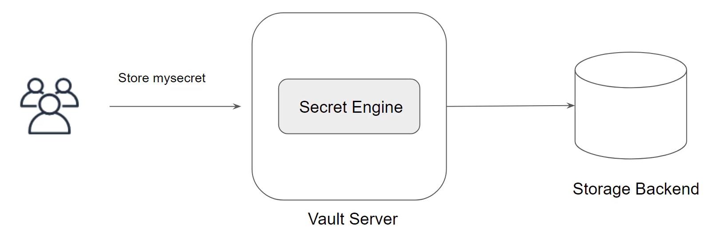
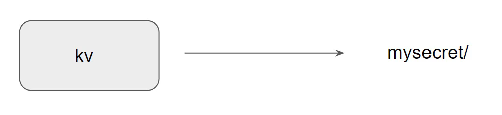

# Overview of Secrets Engine

Secrets engines are components which store, generate, or encrypt data.
You can store secrets based on a specific secrets engine and each offers certain features.

<div align="center">

</div>

## Secrets Engines Types

There are multiple secrets engine types that are available. Each provides specific set of features depending on the use-cases.
Some of the sample secrets engine, includes:

- AWS
- Active directory
- Database
- Key/ Value
- SSH
- Azure

## Secret engine path

Secret engines are enabled at a given path.

<div align="center">

</div>

Once enabled, the secrets are stored inside that path.

```
Vault kv put mysecret/firstsecret mykey-myvalue

```

## Secret Engine Lifecycle

Most secrets engines can be enabled, disabled, tuned, and moves via  the CLI or API.

| Option   | Description |
|----------|------------|
| Enable   | Enables a secrets engine at a specified path. By default, engines are enabled at their **type path** (for example, the `aws` engine is enabled at `aws/`). |
| Disable  | Disables an existing secrets engine. When a secrets engine is disabled, **all of its secrets are revoked**. |
| Move     | Moves the path of an existing secrets engine to a new location. |

## Secret Engine Type-KV (Key/Value)

The KV secrets engine is used to store arbitrary secrets within the configured physical storage for Vault.
Key names must always be strings.
Provides various functionalities like versioning, and others.
