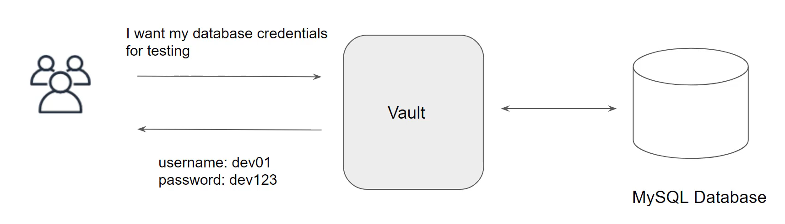
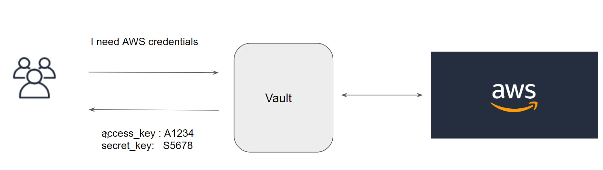

# Dynamic secrets

IN the KV secret engine, we had to manually store the data.
As opposed to that, certain engine works based on dynamic secrets. These secrets do not exist until they are generated.

# Revoking Secrets

Vault will automatically revoke these dynamic credentials, and this can future be tune by setting the lease duration.
Once the secret is revoked, the access keys are no longer valid.
