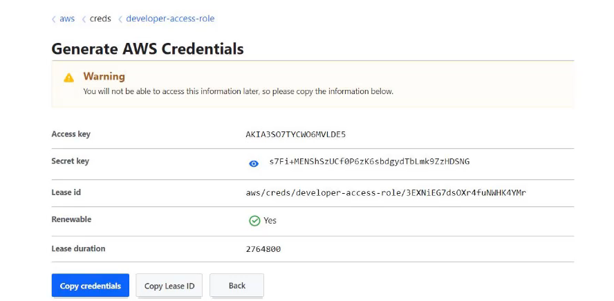
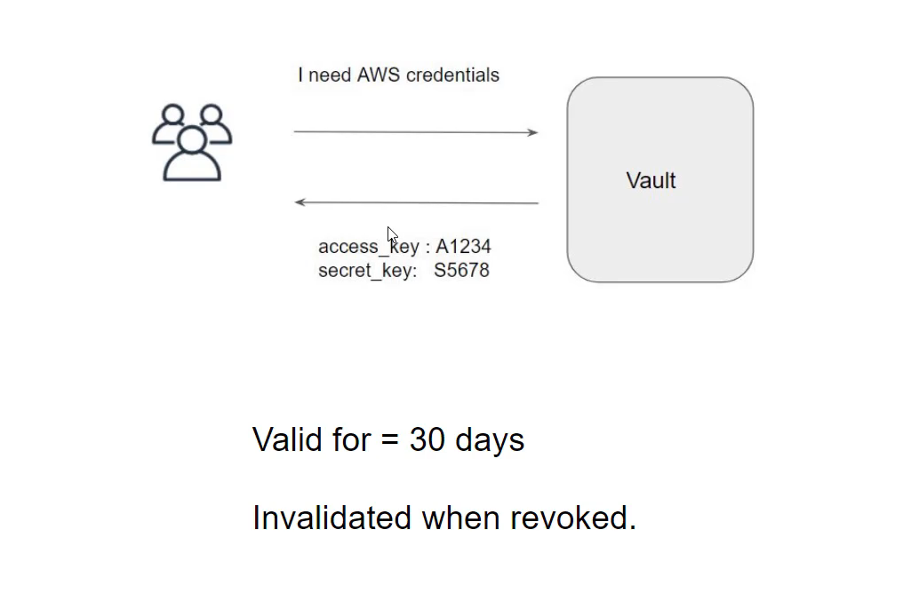

# Overview of Lease

With every dynamic secret and service type authentication token, Vault creates a lease: metadata containing information such as time duration, renewability, and more.
Once the lease is expired, Vault can automatically revoke the data, and the consumer of the secret can no longer be certain that is valid.

## Diagrammatic Representaion

## Lease Related Configuration

| Lease Option | Description |
|-------------|-------------|
| **renew** | Renews the lease on a secret, extending the time it can be used before it is revoked by Vault. |
| **revoke** | Immediately invalidates the secret and prevents any further renewals. |
